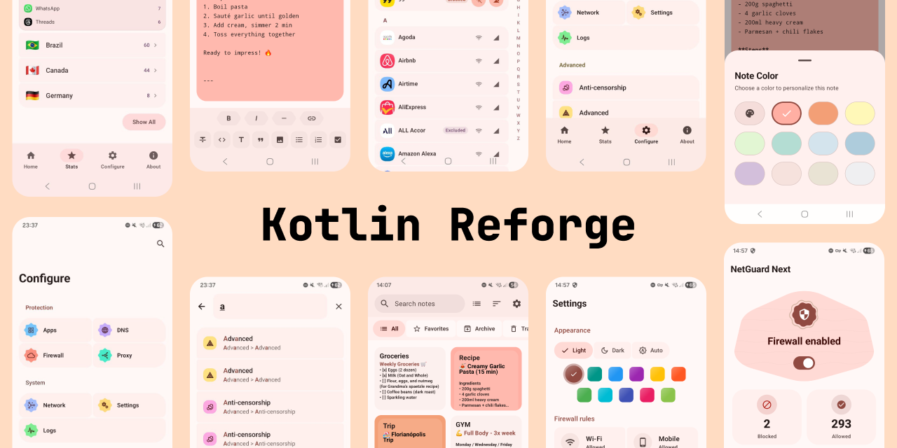

<div align="center">
  <a href="https://kotlin-reforge.vercel.app">
    
  </a>
</div>

<div align="center">
  <strong><a href="https://kotlin-reforge.vercel.app">Live Preview</a></strong>
</div>

<br>

# Kotlin Reforge

**Legacy code. Reforged.**

Transforming fragile, aging Android apps into fast, maintainable, and scalable Kotlin products. This repository hosts the website telling that story.

### The Focus

* **Kotlin-First:** Seamless migrations from legacy Java.
* **Modern Architecture:** Built to scale. Built to last.
* **Flawless UI/UX:** Reimagined to modern standards.

### The Audience

* **Teams:** Stuck with hard-to-evolve apps.
* **Founders:** Ready for a profound technical refresh.
* **Engineers:** Passionate about migration quality.

### Quick Start

```shell
pnpm install
pnpm dev
```

Available at `http://localhost:3000`.

### Deploy

```shell
pnpm build
pnpm start
```
